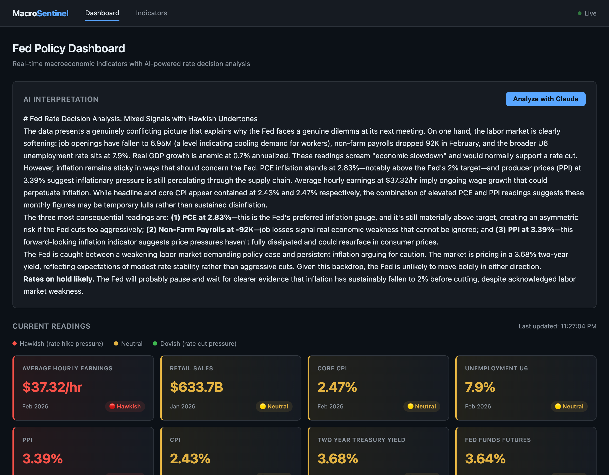

# Macro Sentinel

A real-time macroeconomic sentiment dashboard that tracks key Federal Reserve policy indicators and uses AI to interpret what they mean for the Fed's next rate decision.



## What it does

- Polls the [FRED API](https://fred.stlouisfed.org/) every 5 minutes for 13 macroeconomic indicators
- Serves live data via REST and WebSocket
- Color-codes each indicator as hawkish (rate-hike pressure), neutral, or dovish (rate-cut pressure)
- On demand, sends the current readings to Claude and returns a plain-English Fed policy analysis

## Indicators tracked

| Indicator | Series | Type |
|---|---|---|
| CPI (Headline) | CPIAUCSL | Lagging |
| Core CPI | CPILFESL | Lagging |
| PCE Inflation | PCEPI | Lagging |
| PPI (Producer Prices) | PPIFID | Leading |
| Non-Farm Payrolls | PAYEMS | Lagging |
| Unemployment (U6) | U6RATE | Lagging |
| JOLTS Job Openings | JTSJOL | Leading |
| Avg Hourly Earnings | CES0500000003 | Coincident |
| GDP (Real) | GDPC1 | Lagging |
| Industrial Production | INDPRO | Coincident |
| Retail Sales | RSXFS | Coincident |
| 2Y Treasury Yield | DGS2 | Leading |
| Fed Funds Rate | EFFR | Coincident |

## Stack

- **Rust + Axum** — async HTTP server and WebSocket
- **FRED API** — free St. Louis Fed data, no auth complexity
- **Anthropic Claude API** — AI interpretation of indicator data
- **Vanilla HTML/JS** — no build step, no framework

## Setup

### 1. Get API keys

- **FRED**: [fred.stlouisfed.org/docs/api/api_key.html](https://fred.stlouisfed.org/docs/api/api_key.html) — free account
- **Anthropic**: [console.anthropic.com](https://console.anthropic.com) — pay-per-use

### 2. Set environment variables

```bash
export FRED_API_KEY=your_fred_key
export ANTHROPIC_API_KEY=your_anthropic_key
```

Optional:
```bash
export POLL_INTERVAL_SECONDS=60   # default: 300
export RUST_LOG=info              # default: info
```

### 3. Run

```bash
cargo run
```

Open [http://localhost:3000](http://localhost:3000)

## Pages

**Dashboard** (`/`) — Live indicator readings with hawkish/dovish color coding and the AI interpretation panel.

**Indicators** (`/indicators.html`) — Static reference page explaining what each indicator measures, why the Fed watches it, and what high/low readings mean for rate decisions.

## API

| Method | Path | Description |
|---|---|---|
| GET | `/api/indicators` | All current readings as JSON |
| POST | `/api/interpret` | Trigger Claude AI analysis |
| GET | `/api/health` | Health check |
| GET | `/ws` | WebSocket for live updates |

## Project structure

```
src/
  main.rs         Entry point — wires all modules, boots server
  config.rs       Loads API keys from environment variables
  error.rs        Central error type with HTTP response mapping
  indicators.rs   Data types for all 13 indicators
  state.rs        In-memory data store (Arc<RwLock<AppState>>)
  fred.rs         FRED API client and polling loop
  ai.rs           Claude API integration
  routes.rs       Axum router and HTTP handlers
  websocket.rs    WebSocket push handler
static/
  index.html      Dashboard page
  indicators.html Educational reference page
```

## Security

API keys are read exclusively from environment variables at runtime. They are never hardcoded, never written to files, and never logged.
